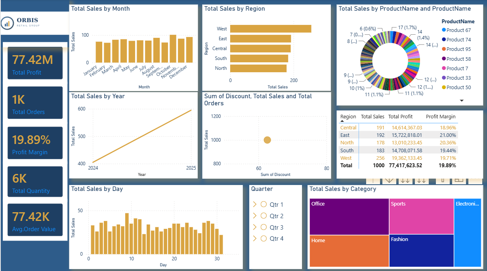

# 📊 Orbis Retail Group — Sales Performance Dashboard

A Power BI dashboard analyzing sales performance for **Orbis Retail Group**, a fictional multi-category retailer operating across 5 regions in India (North, South, East, West, Central). Built to track revenue, profitability, and target achievement across products, customers, and regions.



## 🎯 Project Overview

This project simulates a real-world retail analytics scenario: a company selling Electronics, Fashion, Home, Office, and Sports products through a distributed regional sales team, needing a single source of truth for sales performance, target tracking, and customer/product insights.

## 🗂️ Dataset

| Table | Rows | Description |
|---|---|---|
| `sales.csv` | 1,000 | Order-level transactions — date, customer, product, region, salesperson, quantity, discount, sales amount, cost |
| `customers.csv` | 300 | Customer master — demographics, segment, region, signup date |
| `products.csv` | 100 | Product master — category, subcategory, brand, cost, price |
| `regions.csv` | 5 | Region master — state and city mapping |
| `sales_targets.csv` | 120 | Monthly sales & profit targets per region |

All data is synthetically generated for portfolio/demo purposes.

## 🧮 Data Model

Star schema with `Sales` as the central fact table, connected to `Customers`, `Products`, and `Regions`, plus a `Date` dimension table. A second fact table, `Sales Targets`, connects to `Regions` and `Date` for target-vs-actual comparisons.

## 📈 Key Metrics (KPIs)

- Total Sales · Total Profit · Profit Margin %
- Orders · Quantity · Average Order Value
- Sales YoY % · Target Achievement %

## ❓ Business Questions Answered

- How is the business performing overall, and are we on track against target?
- Which regions, categories, and products drive the most revenue and profit?
- How does revenue trend month over month and year over year?
- Which customer segments and top customers contribute most to sales?
- Does discounting actually drive more orders, or just erode margin?

## 🖥️ Dashboard Pages

1. **Executive Overview** — company-wide KPIs and top-line trends
2. **Sales Trends** — monthly/quarterly/YoY performance
3. **Product Performance** — category, brand, and top-product analysis
4. **Customer Analysis** — segment, demographic, and top-customer insights
5. **Regional Analysis** — target achievement and profitability by region
6. **Order Details** — drill-through transaction-level detail

## 🛠️ Tools Used

- Power BI Desktop (Power Query, Data Modeling, DAX)
- CSV source data

## 📁 Files in this Repo

```
/data
  sales.csv
  customers.csv
  products.csv
  regions.csv
  sales_targets.csv
/dashboard
  Orbis_Sales_Dashboard.pbix
/docs
  Sales_Performance_PowerBI_Build_Guide.docx
orbis_logo.png
```

## 🚀 How to Use

1. Download the `.pbix` file and open it in Power BI Desktop.
2. If prompted, point the data source to the `/data` folder in this repo.
3. Refresh the data model to load the latest CSVs.
